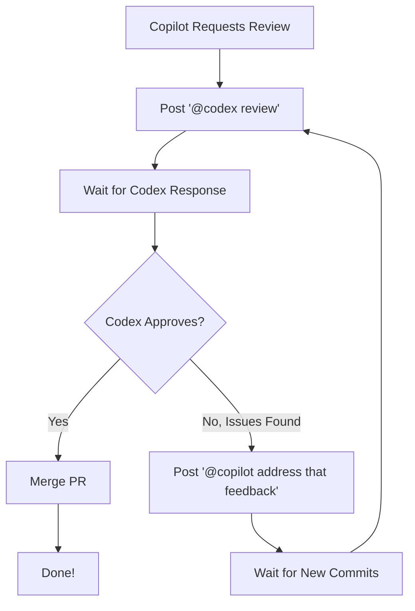

# Copilot/Codex Auto-Review Loop 🔄

Automate the review process between GitHub Copilot and Codex for pull requests. This GitHub Action orchestrates an intelligent review loop that continues until your code meets quality standards.

## 🎯 What Does This Do?

When GitHub Copilot creates a pull request and requests a review, this action automatically:

1. **Requests a review from Codex** by posting `@codex review`
2. **Waits for Codex's response** and analyzes it for approval or issues
3. **If issues are found**, asks Copilot to address them with `@copilot address that feedback`
4. **Waits for Copilot to push fixes**, then repeats the loop
5. **If approved**, automatically merges the PR with squash merge
6. **Continues indefinitely** until Codex genuinely approves the changes



## 🚀 Quick Start

### Option 1: Using the Reusable Workflow (Recommended)

This is the easiest way to add auto-review to your repository.

1. Create `.github/workflows/auto-review.yml` in your repository:

```yaml
name: Copilot/Codex Auto Review

on:
  pull_request:
    types: [review_requested]

permissions:
  contents: write
  pull-requests: write

concurrency:
  group: auto-review-loop-${{ github.event.pull_request.number }}
  cancel-in-progress: false

jobs:
  auto-review:
    if: |
      github.event.review_request &&
      github.event.requested_reviewer.login == 'github-copilot[bot]'
    
    uses: dhabibi/copilot-ralph-wiggum/.github/workflows/auto-review-loop.yml@main
```

2. Commit and push the workflow file
3. Done! The workflow will automatically run when Copilot requests a review

### Option 2: Using the Composite Action

For more control and customization:

1. Create `.github/workflows/auto-review.yml` in your repository:

```yaml
name: Copilot/Codex Auto Review

on:
  pull_request:
    types: [review_requested]

permissions:
  contents: write
  pull-requests: write

concurrency:
  group: auto-review-loop-${{ github.event.pull_request.number }}
  cancel-in-progress: false

jobs:
  auto-review:
    runs-on: ubuntu-latest
    
    if: |
      github.event.review_request &&
      github.event.requested_reviewer.login == 'github-copilot[bot]'
    
    steps:
      - uses: dhabibi/copilot-ralph-wiggum@main
        with:
          pr_number: ${{ github.event.pull_request.number }}
          repository: ${{ github.repository }}
          poll_interval: 30
          timeout_seconds: 3600
          github_token: ${{ secrets.GITHUB_TOKEN }}
```

2. Commit and push the workflow file
3. You can now add additional steps before or after the review loop

## ⚙️ Configuration Options

### Reusable Workflow Inputs

When using the reusable workflow, you can pass these inputs:

```yaml
jobs:
  auto-review:
    uses: dhabibi/copilot-ralph-wiggum/.github/workflows/auto-review-loop.yml@main
    with:
      poll_interval: 30        # Seconds between checks (default: 30)
      timeout_seconds: 3600    # Max wait time in seconds (default: 3600)
```

### Composite Action Inputs

| Input | Description | Required | Default |
|-------|-------------|----------|---------|
| `pr_number` | Pull request number to review | Yes | N/A |
| `repository` | Repository in owner/repo format | No | `${{ github.repository }}` |
| `poll_interval` | Time in seconds between polling | No | `30` |
| `timeout_seconds` | Max time to wait for responses | No | `3600` (1 hour) |
| `github_token` | GitHub token for API access | Yes | N/A |

## 🔍 How It Works

### Trigger Mechanism

The workflow is triggered when:
- A pull request receives a review request (`pull_request: types: [review_requested]`)
- The requester is `github-copilot[bot]`

### Review Loop Logic

1. **Request Review**: Posts `@codex review` as a comment on the PR
2. **Poll for Response**: Checks PR comments every 30 seconds (configurable)
3. **Parse Response**: Analyzes Codex's comment for approval or issues
4. **Decision Point**:
   - **Approved**: Enable auto-merge with squash
   - **Issues Found**: Post `@copilot address that feedback`
5. **Wait for Updates**: Polls for new commits from Copilot
6. **Repeat**: Goes back to step 1 until approved

### Approval Detection

The script uses a simple but effective heuristic:

**Approval Keywords**: "lgtm", "looks good", "approve", "no issues", "ready to merge", "ship it"

**Issue Keywords**: "issue", "problem", "bug", "fix", "concern", "should", "must", "error", "needs"

**Logic**: Approved = (has approval keywords) AND (no issue keywords)

### Edge Cases Handled

- ✅ **PR Already Merged**: Detects and exits gracefully
- ✅ **Timeout Protection**: Fails after 1 hour of no response (configurable)
- ✅ **Duplicate Prevention**: Concurrency groups prevent multiple runs on same PR
- ✅ **Comment Tracking**: Avoids reprocessing the same comments

### Permissions Required

```yaml
permissions:
  contents: write        # Required to enable auto-merge
  pull-requests: write   # Required to post comments
```

## 📋 Examples

See the [`examples/`](./examples) directory for complete workflow examples:

- **[basic-usage.yml](./examples/basic-usage.yml)**: Minimal setup using the reusable workflow
- **[custom-usage.yml](./examples/custom-usage.yml)**: Using the composite action with custom options and additional steps

## 🔧 Troubleshooting

### Workflow Not Triggering

**Problem**: The workflow doesn't run when Copilot requests a review.

**Solutions**:
- Verify the workflow file is in `.github/workflows/` directory
- Check that the trigger includes `types: [review_requested]`
- Ensure the conditional check for `github-copilot[bot]` is correct
- Review the Actions tab for any workflow errors

### Timeout Errors

**Problem**: The workflow fails with "Timeout waiting for response."

**Solutions**:
- Increase `timeout_seconds` input (default is 3600 seconds / 1 hour)
- Check if Codex or Copilot bots are actually responding to mentions
- Verify bot permissions in your repository

### Loop Not Detecting Approval

**Problem**: Codex approves but the loop continues.

**Solutions**:
- Review Codex's response wording - it must contain approval keywords
- Check the workflow logs to see how the response was parsed
- Ensure the response doesn't contain any issue keywords

### Multiple Workflows Running

**Problem**: Multiple instances of the workflow run simultaneously.

**Solution**: Ensure you have the concurrency group configured:

```yaml
concurrency:
  group: auto-review-loop-${{ github.event.pull_request.number }}
  cancel-in-progress: false
```

### Permission Errors

**Problem**: "Resource not accessible by integration" errors.

**Solutions**:
- Verify permissions in the workflow file:
  ```yaml
  permissions:
    contents: write
    pull-requests: write
  ```
- Check repository settings → Actions → Workflow permissions
- Ensure "Read and write permissions" is enabled

### Script Not Found

**Problem**: "scripts/review-loop.sh: No such file or directory"

**Solutions**:
- If using the composite action, it automatically downloads the script
- If using the reusable workflow, ensure you're referencing the correct repo/branch
- Verify the checkout action runs before the review loop

## 🛠️ Development

### Testing Locally

You can test the review loop script locally:

```bash
# Make the script executable
chmod +x scripts/review-loop.sh

# Run with a test PR
export GH_TOKEN="your-github-token"
./scripts/review-loop.sh <pr-number> <owner/repo> 30 3600
```

### Customizing the Script

The core logic is in `scripts/review-loop.sh`. You can:

- Modify approval/issue keywords
- Change polling intervals
- Add custom logging
- Integrate with other tools

### Using in Your Own Action

You can copy the script to your repository and customize it:

```bash
mkdir -p scripts
curl -sSL "https://raw.githubusercontent.com/dhabibi/copilot-ralph-wiggum/main/scripts/review-loop.sh" \
  -o scripts/review-loop.sh
chmod +x scripts/review-loop.sh
```

## 🤝 Contributing

Contributions are welcome! Please feel free to submit issues or pull requests.

### Ideas for Enhancement

- [ ] Support for multiple reviewers
- [ ] Configurable approval/issue keywords
- [ ] Slack/email notifications
- [ ] Metrics and analytics
- [ ] Support for different merge strategies
- [ ] Integration with code quality tools

## 📄 License

This project is available for use in any project.

## 🙋 Support

If you encounter issues:

1. Check the [Troubleshooting](#-troubleshooting) section
2. Review workflow logs in the Actions tab
3. Open an issue with:
   - Workflow logs
   - PR link
   - Expected vs actual behavior

---

**Made with ❤️ for automating code reviews**
