# Ralph Wiggum on Crack 🚀

**Automate your entire dev workflow from issue to merge using AI coding agents**

This GitHub Action automates the code review loop between GitHub Copilot (or any coding agent) and Codex (or any review agent), eliminating the manual back-and-forth. Create an issue, assign it to an agent, and let the automation handle the rest until the code is reviewed, approved, and merged.

## 🎯 What This Does

This implements what I used to do manually:

1. Create an issue (via CLI, GitHub UI, Linear, Discord bot, etc.) and assign it to @copilot
2. Copilot works on it, opens a PR, and pings me for review
3. I post `@codex review`
4. If Codex finds issues, I post `@copilot address that feedback`
5. Repeat steps 3-4 until Codex approves, then I merge

**Now it's fully automated.** The only human interaction needed is creating the issue and assigning it to an agent.

## 💡 Why This Matters

### The Old Way (Manual)
- Create issue → assign to Copilot → wait for PR → post "@codex review" → read feedback → post "@copilot address that" → repeat until clean → merge
- Requires constant monitoring and manual intervention
- Bottlenecked by your availability

### The New Way (Automated)
- Create issue → assign to agent → **it just works**
- The review loop runs automatically until code quality standards are met
- Works 24/7 without supervision
- Scales to multiple simultaneous issues (as long as they don't conflict)

## 🔧 What You Need

1. **Issue tracker** - Linear, GitHub Issues, Discord/Telegram bot, CLI tools (Claude Code, Opencode, Poke, etc.)
2. **Coding agent** - @copilot, @codex, @claude, or any agent that can open PRs
3. **Review agent** - @codex (my preference - superhuman at bug finding), @claude, or others
4. **This GitHub Action** - Add it to your repo (instructions below)

## 🎪 How The Automation Works

When a coding agent (like Copilot) opens a PR and requests review, this action automatically:

1. **Posts** `@codex review` to request code review
2. **Waits** for Codex's response and analyzes it for approval or issues
3. **If issues found** → posts `@copilot address that feedback` and waits for fixes
4. **If approved** → automatically merges the PR with squash merge
5. **Loops** until Codex genuinely approves (no artificial limits)

```mermaid
graph TD
    A[Agent Opens PR & Requests Review] --> B[Action Posts '@codex review']
    B --> C[Wait for Codex Response]
    C --> D{Codex Approves?}
    D -->|Yes| E[Merge PR Automatically]
    D -->|No, Issues Found| F[Post '@copilot address that feedback']
    F --> G[Wait for New Commits]
    G --> B
    E --> H[Done!]
```



## 🌟 Why This is Powerful

### Benefits of GitHub-Native Automation

**a) Leverage Codex ($20/mo)** - The best code reviewer, period. Superhuman bug detection.

**b) Flexible Agent Choice** - Use @copilot ($10/mo), @claude, or any other agent. Swap agents by changing the @ command.

**c) No Local Dependencies** - Create issues from anywhere (phone, CLI, web). No long-running sessions on your PC required.

**d) Plays Nice with Everything** - Works with any CI/CD, issue tracker, or project management tool that has git integrations (which is all of them).

**e) Scalability** - Run multiple issues in parallel. As long as they don't conflict, you can coordinate a "disgusting amount of agents" simultaneously.

### vs Terminal-Based CLI Coding

I think this is superior to terminal-based CLI coding for **most people** because:
- You're not tied to a terminal session
- It integrates with existing workflows and tools
- Multiple issues can progress simultaneously
- Review quality is consistent (same agent, same standards)

If you're already versed in CLI coding, you can **still hook into this** by auto-creating issues via CLI or chatbots.

## 🚀 Quick Start

### Step 1: Add the Workflow to Your Repo

Create `.github/workflows/auto-review.yml` in your repository:

```yaml
name: Copilot/Codex Auto Review

on:
  pull_request:
    types: [review_requested]

permissions:
  contents: write
  pull-requests: write

concurrency:
  group: auto-review-loop-${{ github.event.pull_request.number }}
  cancel-in-progress: false

jobs:
  auto-review:
    if: |
      github.event.requested_reviewer &&
      github.event.requested_reviewer.login == 'github-copilot[bot]'

    uses: dhabibi/copilot-ralph-wiggum/.github/workflows/auto-review-loop.yml@main
```

Commit and push. That's it!

### Step 2: Start Using It

1. **Create an issue** (GitHub UI, Linear, CLI, chatbot, etc.)
2. **Assign it to an agent** (e.g., @copilot)
3. **Walk away** - The agent will implement it, the review loop will run automatically, and the PR will merge when approved

### Advanced: Using the Composite Action

For more control (e.g., custom steps, notifications):

1. Create `.github/workflows/auto-review.yml` in your repository:

```yaml
name: Copilot/Codex Auto Review

on:
  pull_request:
    types: [review_requested]

permissions:
  contents: write
  pull-requests: write

concurrency:
  group: auto-review-loop-${{ github.event.pull_request.number }}
  cancel-in-progress: false

jobs:
  auto-review:
    runs-on: ubuntu-latest

    if: |
      github.event.requested_reviewer &&
      github.event.requested_reviewer.login == 'github-copilot[bot]'

    steps:
      - uses: dhabibi/copilot-ralph-wiggum@main
        with:
          pr_number: ${{ github.event.pull_request.number }}
          repository: ${{ github.repository }}
          poll_interval: 30
          timeout_seconds: 3600
          github_token: ${{ secrets.GITHUB_TOKEN }}

      # Add your custom steps here (e.g., notifications)
      - name: Notify on completion
        if: success()
        run: echo "Review loop completed!"
```

## 📊 Typical Workflow Example

Here's what a complete workflow looks like:

```
You: Create issue "Add user authentication" in Linear/GitHub
You: Assign issue to @copilot
↓
Copilot: Works on it, opens PR, requests review
↓
Action: Posts "@codex review"
↓
Codex: "There's a SQL injection vulnerability in line 42"
↓
Action: Posts "@copilot address that feedback"
↓
Copilot: Fixes the issue, pushes new commits
↓
Action: Posts "@codex review"
↓
Codex: "LGTM, no issues found"
↓
Action: Merges PR automatically
↓
Done! Feature shipped without your involvement.
```

## ⚙️ Configuration Options

### Reusable Workflow

```yaml
uses: dhabibi/copilot-ralph-wiggum/.github/workflows/auto-review-loop.yml@main
with:
  poll_interval: 30        # Seconds between checks (default: 30)
  timeout_seconds: 3600    # Max wait time (default: 3600 = 1 hour)
```

### Composite Action

| Input | Description | Required | Default |
|-------|-------------|----------|---------|
| `pr_number` | Pull request number to review | Yes | N/A |
| `repository` | Repository in owner/repo format | No | `${{ github.repository }}` |
| `poll_interval` | Time in seconds between polling | No | `30` |
| `timeout_seconds` | Max time to wait for responses | No | `3600` (1 hour) |
| `github_token` | GitHub token for API access | Yes | N/A |

## 🔍 How It Works

### Trigger Mechanism

The workflow is triggered when:
- A pull request receives a review request (`pull_request: types: [review_requested]`)
- The requester is `github-copilot[bot]`

### Review Loop Logic

1. **Request Review**: Posts `@codex review` as a comment on the PR
2. **Poll for Response**: Checks PR comments every 30 seconds (configurable)
3. **Parse Response**: Analyzes Codex's comment for approval or issues
4. **Decision Point**:
   - **Approved**: Enable auto-merge with squash
   - **Issues Found**: Post `@copilot address that feedback`
5. **Wait for Updates**: Polls for new commits from Copilot
6. **Repeat**: Goes back to step 1 until approved

### Approval Detection

The script uses intelligent pattern matching with word boundaries to detect approval:

**Explicit Approval Phrases** (override issue detection):
- "no issues", "lgtm", "looks good", "ready to merge", "ship it"

**General Approval Keywords**:
- "approve", "approved" (but excludes negations like "not approved")

**Issue Indicators** (trigger another iteration):
- Patterns like "there is/are * issue/problem"
- "found * issue/problem", "has * issue/problem/bug"
- Keywords: "problem", "bug", "concern", "error"
- "must fix", "should fix", "need/needs * fix"

**Logic**:
1. If response contains explicit approval phrases → **APPROVED** (even if issues mentioned)
2. Else if "approve/approved" found AND no issue indicators → **APPROVED**
3. Otherwise → **NOT APPROVED** (continue loop)

**Examples**:
- ✅ "LGTM, ship it!" → APPROVED
- ✅ "No issues found" → APPROVED
- ✅ "This is approved" → APPROVED
- ❌ "There is an issue here" → NOT APPROVED
- ❌ "Approved but has a problem" → NOT APPROVED
- ❌ "This is not approved" → NOT APPROVED

### Edge Cases Handled

- ✅ **PR Already Merged**: Detects and exits gracefully
- ✅ **Timeout Protection**: Fails after 1 hour of no response (configurable)
- ✅ **Duplicate Prevention**: Concurrency groups prevent multiple runs on same PR
- ✅ **Comment Tracking**: Avoids reprocessing the same comments

### Permissions Required

```yaml
permissions:
  contents: write        # Required to enable auto-merge
  pull-requests: write   # Required to post comments
```

## 📋 Examples

See the [`examples/`](./examples) directory for complete workflow examples:

- **[basic-usage.yml](./examples/basic-usage.yml)**: Minimal setup using the reusable workflow
- **[custom-usage.yml](./examples/custom-usage.yml)**: Using the composite action with custom options and additional steps

## 🔧 Troubleshooting

### Workflow Not Triggering

**Problem**: The workflow doesn't run when an agent requests review.

**Solutions**:
- Verify `.github/workflows/auto-review.yml` exists
- Check trigger includes `types: [review_requested]`
- Ensure the bot username in the `if` condition is correct
- Check Actions tab for errors

### Timeout Errors

**Problem**: "Timeout waiting for response"

**Solutions**:
- Increase `timeout_seconds` (default: 3600s = 1 hour)
- Verify the review agent is responding to @ mentions
- Check bot permissions in repository settings

### Loop Not Detecting Approval

**Problem**: Review agent approves but loop continues

**Solutions**:
- Review agent's exact wording - must contain approval keywords
- Check workflow logs to see how response was parsed
- Ensure response doesn't contain issue keywords

### Permission Errors

**Problem**: "Resource not accessible by integration"

**Solutions**:
- Verify workflow has required permissions:
  ```yaml
  permissions:
    contents: write
    pull-requests: write
  ```
- Check Settings → Actions → Workflow permissions
- Enable "Read and write permissions"

## 🎓 Pro Tips

- **Break down tasks well** - Avoid merge conflicts by ensuring issues are mutually exclusive
- **Use descriptive issue titles** - Helps agents understand context
- **Monitor first few runs** - Tune timeout and polling settings if needed
- **Chain multiple agents** - Different agents for different parts of your stack
- **Integrate with your tools** - Create issues from Slack, Discord, Linear, etc.

## 📁 Repository Structure

```
.github/workflows/
  └── auto-review-loop.yml    # Reusable workflow
action.yml                    # Composite action
scripts/
  └── review-loop.sh          # Core bash logic
examples/
  ├── basic-usage.yml         # Simple setup example
  └── custom-usage.yml        # Advanced setup example
```

## 🤝 Contributing

This is an automation tool for coordinating AI agents. Ideas for enhancement:
- Support for multiple reviewers
- Configurable approval/issue keywords
- Integration with Slack/email notifications
- Metrics and analytics dashboard
- Support for different merge strategies

## 📄 License

Free to use in any project.

## 🙋 Support

If you encounter issues:
1. Check the Troubleshooting section above
2. Review workflow logs in the Actions tab
3. Open an issue with logs and PR link

---

**Built for the future of software development** - Where humans orchestrate AI agents, and agents do the heavy lifting.
